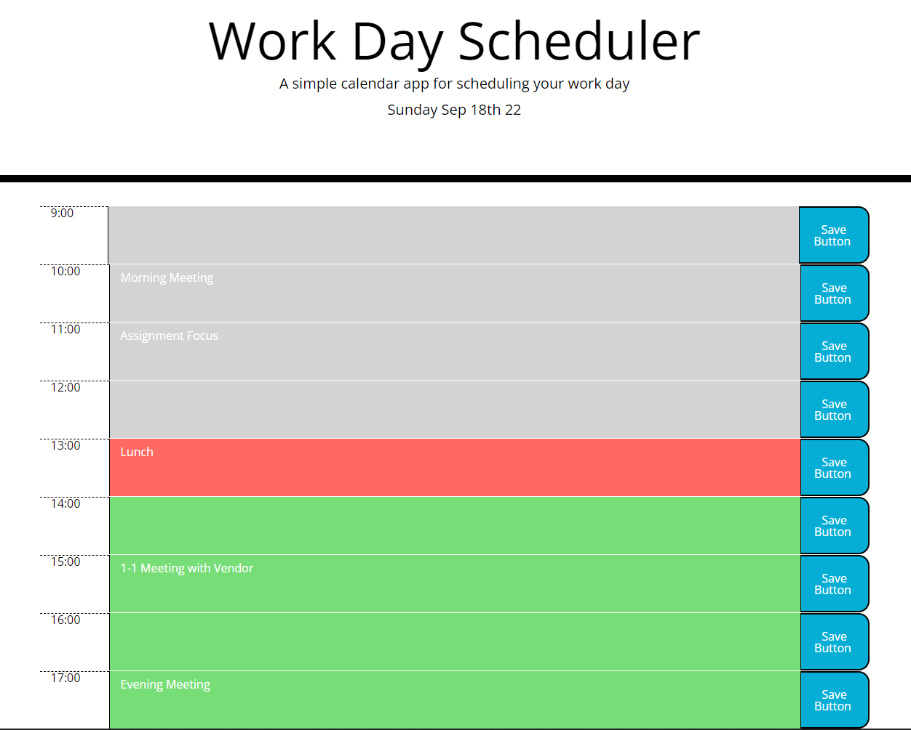

# <work-day-scheduler>

## Description

The main objective of this project was to create a simple day scheduler. The focus on the project was the use of styling with Bootstrap and functionality with Jquery. The scheduler with style the page depending on the current time, allows for quick agenda changes, and storage of the agenda items to local storage.

## Installation

This is a project that is available online via weblink.
https://samlee088.github.io/work-day-scheduler/
Additionally, the back-end coding is available for download through github.
https://github.com/samlee088/work-day-scheduler

## Usage

The work-day-scheduler will automatically update with color styling depending on the current time. 

In order to add an event to a block of time, a user can ‘click’ into a block and add in text. After adding in text, a ‘save’ button must be ‘clicked’ in order for the newly added item to be saved to the local storage. 

In order to delete, or update an agenda item, the user must update in the block of time, and ‘click’ on the save button in order for the change to take effect. 

   
    
    

## Credits

NA

## License

NA

---
